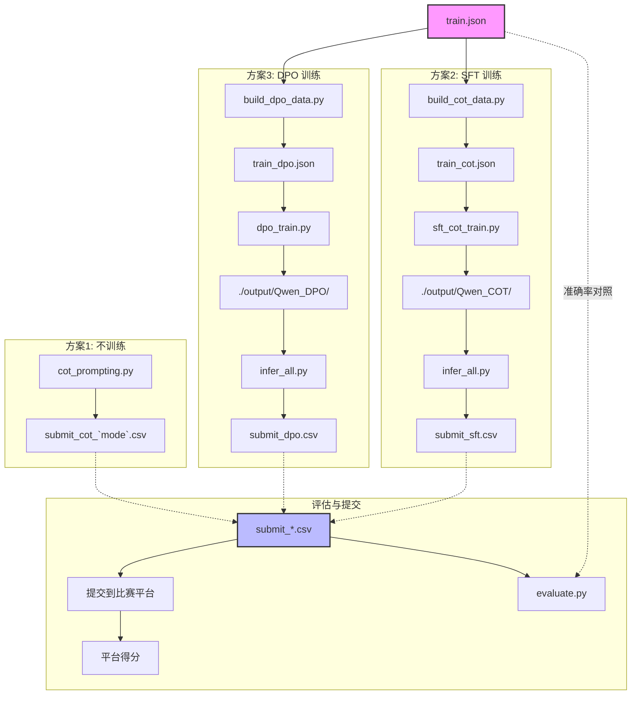

# 小学数学应用题自动解题 — 实操示范总结

## 本地验证结果

在本地 CPU 上用小样本验证了 Qwen2.5-0.5B 的推理和训练流程：

### 零样本 CoT（方案1，不需要训练）

用"请逐步推理，最后以答案是[数字]格式给出答案"的提示词，在 5 道测试题上跑 CoT 推理：

| 题目 | 期望答案 | 模型输出 | 结果 |
|------|----------|----------|------|
| (91.64+7.36)×(43.6-3.6) | 3960 | 3960 | 正确 |
| 书架上下层问题 | 18 | 91 | 错误 |
| 32人÷3人/船 | 11 | 11 | 正确 |
| 课堂时间计算 | 0.25 | 23.33 | 错误 |
| 50元÷7.9元/盒 | 6 | 6 | 正确 |

**准确率 3/5 = 60%**，而直接回答模式（不要求逐步推理）准确率 0/5。说明 CoT 提示词对 0.5B 小模型有明显提升。

### SFT 训练（方案2，验证 pipeline）

用 30 条训练数据、1 epoch、CPU、LoRA (r=8)，训练耗时 **1分44秒**。pipeline 正常运行，loss 下降（3.36）。30 条数据太少导致 SFT 效果不明显，但这只是验证——在 GPU 上跑完整 12000 条数据 + 3~5 epoch 才会看到实质提升。

---

## 远程服务器操作指南

### 环境准备

```bash
# 1. 克隆项目（如果你是直接拷贝代码，跳过这一步）
git clone https://github.com/LC-Player/MathSolver_AI2026SpringPJ2.git math_solver && cd math_solver

# 2. 如果使用本地PC跑跑的话
# 2.1  创建 conda 环境 
conda create -n math_solver python=3.10 -y
conda activate math_solver

# 2.2  安装依赖
pip install -r requirements.txt

# 如果用远程跑的话，视情况安装 transformers modelscope peft swanlab
```

### 下载模型

```bash
python -c "from modelscope import snapshot_download; \
  snapshot_download('Qwen/Qwen2.5-0.5B-Instruct', cache_dir='./', revision='master')"
```

下载后把模型路径修正为 `./Qwen/Qwen2.5-0.5B-Instruct/`（modelscope 可能把文件放在带下划线的缓存目录，需要手动处理）。

### 方案1：CoT 提示词推理（不训练，直接跑）

```bash
# 零样本 CoT
python cot_prompting.py --mode zero_shot
# 产出: submit_cot_zero_shot.csv

# 少样本 CoT
python cot_prompting.py --mode few_shot
# 产出: submit_cot_few_shot.csv

# 建议先小样本测试
python cot_prompting.py --mode zero_shot --max_samples 10
```

### 方案2：数据构建 + CoT SFT 训练

```bash
# Step A: 构建 CoT 数据（给训练集补充推理步骤）
# 建议先用 500 条测试，确认没问题后跑完整 12000 条
python build_cot_data.py --max_samples 500
python build_cot_data.py --augment    # 跑完整数据 + 数据增强

# Step B: SFT 训练
python sft_cot_train.py --num_epochs 5 --batch_size 4
# 完整训练约 2-4 小时 (GPU)

# Step C: 推理
python infer_all.py --mode sft --lora_path ./output/Qwen_COT
# 产出: submit_sft.csv

# Step D: 本地评估（用 train.json 验证）
python evaluate.py submit_sft.csv
```

### 方案3：DPO 训练（需要先修好 trl 包）

```bash
# 包问题：trl 1.5.0 与 transformers 5.9.0 不兼容
# 如果遇到 trl 导入错误，运行：
pip install trl==0.12.0

# Step A: 构建 DPO 偏好数据
python build_dpo_data.py

# Step B: DPO 训练
python dpo_train.py --num_epochs 1 --batch_size 4

# Step C: 推理
python infer_all.py --mode dpo --lora_path ./output/Qwen_DPO
# 产出: submit_dpo.csv
```

### 提交到比赛平台

把生成的 `submit_xxx.csv` 提交到 https://www.datafountain.cn/competitions/467 的"作品提交"入口。每日 3 次提交机会。

---

## 文件说明

### 数据文件

| 文件 | 作用 |
|------|------|
| `train.json` | 训练集，12000 条。每题有 `question`（题目）、`answer`（正确答案）、`instruction`（要求直接输出数字答案）。**你可以修改此文件来构建增强数据**。 |
| `test.json` | 测试集，8000 条。每题有 `question`、无答案。**规则严禁处理测试数据**。 |
| `submit.csv` | Baseline 的提交模板，文件格式为 `id,答案`，无表头。每次推理产出同格式的 csv 文件提交到平台。 |

### Baseline 文件（原始仓库自带）

| 文件 | 作用 |
|------|------|
| `qwen_ft.py` | Baseline 训练脚本。直接对 train.json 做 SFT，让模型学会「读题 → 输出答案」。不涉及 CoT 推理。 |
| `infer.py` | Baseline 推理脚本。加载训练好的 LoRA 模型，对 test.json 逐题推理，生成 submit.csv。 |
| `README.md` | 原始仓库的简要说明。 |

### 公用模块

| 文件 | 作用 |
|------|------|
| `utils.py` | 所有脚本共用的工具函数：`extract_answer()` 从模型输出中提取数字答案、`load_json()` / `save_json()`、`load_csv_submit()` / `save_csv_submit()` 读写提交文件、`evaluate()` 本地评估准确率、`FEW_SHOT_EXAMPLES` 少样本 CoT 的示例题库。 |

### 方案1：CoT 提示词（不训练）

| 文件 | 作用 |
|------|------|
| `cot_prompting.py` | 加载 Qwen-0.5B 基础模型（不经任何训练），用 CoT 提示词直接做推理。支持 `--mode zero_shot`（提示词含"请逐步推理"）和 `--mode few_shot`（提示词含 4 道带推理步骤的示例题）。产出 `submit_cot_{mode}.csv`。 |

### 方案2：数据构建 + CoT SFT 训练

| 文件 | 作用 |
|------|------|
| `build_cot_data.py` | **Phase 1**：给 train.json 的每道题生成推理步骤。用 base 模型 + 正确答案作为提示，让模型「反向」补出解题过程。可选 `--augment` 做数据增强（修改原题中的数字，乘 2/3/0.5 生成新题）。产出 `train_cot.json`，格式：`{question, answer, reasoning, instruction}`。 |
| `sft_cot_train.py` | **Phase 2**：用 train_cot.json（或其他含 `reasoning` 字段的数据）做 LoRA SFT 训练。让模型学会「读题 → 逐步推理 → 输出答案」。核心参数：`--num_epochs`、`--batch_size`、`--device auto/cpu`。产出 `./output/Qwen_COT/` 检查点。 |

### 方案3：DPO 训练

| 文件 | 作用 |
|------|------|
| `build_dpo_data.py` | **Phase 1**：构建偏好对数据。对每道题生成两种推理：**chosen**（给定正确答案 → 产生正确推理）和 **rejected**（给定错误答案或直接推理 → 产生可能错误的推理）。产出 `train_dpo.json`，格式：`{question, instruction, chosen, rejected}`。 |
| `dpo_train.py` | **Phase 2**：用 train_dpo.json 做 DPO 训练（基于 TRL 库的 `DPOTrainer`）。让模型学会区分和偏好正确的推理链。核心参数：`--num_epochs`、`--batch_size`、`--beta`（DPO 温度）。产出 `./output/Qwen_DPO/` 检查点。 |

### 推理与评估

| 文件 | 作用 |
|------|------|
| `infer_all.py` | 统一推理入口。支持 `--mode base/sft/dpo`，对应三种模型来源（基础模型 / SFT LoRA / DPO LoRA）。加载模型后对 test.json 做推理，自动提取答案，产出 submit csv。 |
| `evaluate.py` | 本地评估脚本。给定一个 submit csv 文件，用 train.json 的标签计算准确率。用法：`python evaluate.py submit_sft.csv`。**注意**：test.json 没有标签，无法直接用此脚本评估——必须提交到比赛平台看分数。 |

### 配置文件

| 文件 | 作用 |
|------|------|
| `requirements.txt` | Python 依赖清单：torch、transformers、modelscope、peft、trl、accelerate、tqdm。 |
| `.gitignore` | 忽略模型文件（`Qwen/`）、训练产出（`output/`）、生成的 csv 和 json、缓存目录。 |

### 文件之间的依赖关系


---

## 按课程要求你需要做的事

### 比赛截止：2026年6月11日

| 事项 | 说明 |
|------|------|
| **提交 csv 到平台** | 用方案1/2/3 各自生成 csv，挑效果最好的提交。提交到 DataFountain 平台后截图保存成绩。 |
| **截图成绩** | 平台上的最好排名和分数截图，上传到 elearning。 |
| **CSV 文件** | 提交最好的 csv 文件到 elearning。 |

### 报告截止：2026年6月19日

| 事项 | 说明 |
|------|------|
| **最终代码** | 上传所有代码到 elearning。 |
| **方案报告（4 页）** | 报告应包含：每个方案的实现描述、实验结果（准确率对比）、实验分析（为什么某个方案好/不好）。 |
| **PPT**（可选） | 如果有 15 周汇报，准备 PPT。 |

### 计分公式

```
比赛分 s1 = score × 15    （score 是平台准确率）
工作量分 s2 = 方案数 × 3  （组队，每个方案 3 分；个人的话每个 5 分）
总分 = min(s1 + s2, 15)
```

你目前有 3 个方案（CoT提示、数据构建+SFT、DPO），工作量分 = 9 分。只要平台 score > 0.4，总分就满 15 分。

如果你打算再做第 4 个方案（GRPO），就是 12 分工作量分，几乎不需要比赛分数就能满。

### 推荐顺序

1. **先提交方案1**（CoT 零样本 + 少样本）→ 最快出分
2. **跑方案2**（数据构建 + SFT）→ 在 GPU 上跑完整训练
3. **跑方案3**（DPO）→ 依赖方案2的 CoT 数据
4. **写报告**（4 页）→ 分析三种方案的效果差异

---

## 进一步探索指南

上面三个方案是基础框架。以下从"学习理解"和"改进扩展"两个维度，告诉你还能做什么、怎么做。

### 第零步：从 TA 材料到当前代码的学习路径

如果你对 LLM 微调不熟悉，建议按以下顺序阅读和理解：

**1. 先理解数据（10 分钟）**

打开 `train.json`，看 20~30 条数据，理解：
- 题目类型：加减乘除、分数小数、行程问题、工程问题等
- 答案格式：整数（`315`）、小数（`7.5`）、分数（`4/5`）
- instruction 字段：告诉模型"直接输出数字答案"

**2. 理解 baseline（20 分钟）**

打开 `qwen_ft.py`，一行行读：
- 第 10~30 行 `process_func`：如何把 Q&A 对转成训练格式。关键是 `labels = [-100] * len(instruction) + response` —— 只在答案部分计算 loss。
- 第 32~36 行：ModelScope 下载模型 → transformers 加载。
- 第 47~56 行：LoRA 配置 —— `r=8` 是低秩矩阵的维度（越小参数越少），`target_modules` 是插入 LoRA 的层。
- 第 58~69 行：TrainingArguments —— `per_device_train_batch_size`、`num_train_epochs`、`learning_rate`。

然后读 `infer.py`：看如何用 `apply_chat_template` 构造 prompt，用 `model.generate` 做推理。

**3. 对比理解方案1：CoT 提示词（30 分钟）**

打开 `cot_prompting.py`，对比 baseline 的关键差异：
- Baseline 的 instruction："无需进行分析，请直接输出数字答案"
- CoT 的 instruction："请一步一步地推理，最后以'答案是[数字]'给出最终答案"

**不需要训练**，只改了 prompt，就能提升准确率（本地验证 0% → 60%）。这说明 prompt engineering 本身就是一种有效的方案。

再打开 `utils.py`，找到 `FEW_SHOT_EXAMPLES`——这是手写的 4 道带推理步骤的例题。Few-shot CoT 把这些例题塞进 prompt，让模型模仿。你可以尝试替换这些例题、增加更多类型。

**4. 对比理解方案2：数据构建 + SFT（40 分钟）**

打开 `build_cot_data.py`：
- 核心思路：把正确答案告诉模型，让它反推解题过程。
- `generate_reasoning()` 函数：构造 prompt `"题目：xxx，正确答案是：xxx，请写出解题步骤"`，然后用模型生成推理链。
- `augment_numbers()` 函数：数据增强 —— 把原题中的数字 ×2、×3、×0.5，生成新题目。

打开 `sft_cot_train.py`：
- 和 baseline `qwen_ft.py` 结构几乎一样，但训练目标从"直接输出答案"变成了"输出推理步骤+答案"。
- `process_func()` 中 `target_text = example.get("reasoning", example["answer"])` —— 如果有推理步骤就用推理步骤，否则回退到纯答案。

**5. 对比理解方案3：DPO（40 分钟）**

打开 `build_dpo_data.py`：
- 对同一道题生成两种推理：`chosen`（给定正确答案）和 `rejected`（给定错误答案或不给提示）。
- `make_wrong_answer()` 函数故意制造错误答案（+1、-1、+10 等）。

打开 `dpo_train.py`：
- 不是传统的 loss 函数（交叉熵），而是 DPO loss：让模型对 chosen 输出的概率 > 对 rejected 输出的概率。
- `beta=0.1` 控制偏离原模型的程度 —— 越小越激进，越大越保守。

### 可以改进的方向

#### A. 改进现有方案（不需要新文件）

| 改进点 | 文件 | 怎么做 |
|--------|------|--------|
| **调参** | `sft_cot_train.py` | 试不同 `--learning_rate`（1e-5、5e-5、1e-4）、`--num_epochs`（3/5/10）、LoRA `r`（4/8/16）。这些对最终准确率影响很大。 |
| **优化 few-shot 例题** | `utils.py` → `FEW_SHOT_EXAMPLES` | 当前只有 4 道例题。从 train.json 中挑选不同类型的题目（行程、工程、分数、几何），手写更多样化的推理示例，覆盖不同题型。 |
| **改进答案提取** | `utils.py` → `extract_answer()` | 当前用正则。如果模型输出格式不规范（比如 CoT 推理中夹杂多个数字），可能提取错误。可以改成：优先匹配"答案是X"，其次找最后一个数字，再次找 `\boxed{X}`。 |
| **增强答案提取** | `build_dpo_data.py` → `generate_rejected()` | 当前用错误答案误导模型来生成 rejected。更好的做法：计算 rejected 推理的最终答案是否真的错了，如果碰巧对了就丢弃这对数据。 |
| **数据增强策略** | `build_cot_data.py` → `augment_numbers()` | 当前只做乘法。可以增加：改人名/物品名、改场景描述、改单位（千克→克），使数据更多样。 |

#### B. 添加新方案（需要新文件）

| 方案 | 工作量 | 说明 |
|------|--------|------|
| **方案4：GRPO** | 大 | 参考 [Open-R1](https://github.com/huggingface/open-r1)。每条题让模型生成 4~8 个推理，用规则奖励函数打分（最终答案正确 → +1），组内归一化后更新策略。TRL 库的 `GRPOTrainer` 可直接用。 |
| **方案X：答案验证器** | 中 | 训练一个小分类器（基于 Qwen-0.5B 的最后 hidden state），判断推理链是否会导致正确答案。用于给 GRPO 提供更精细的奖励信号。 |
| **方案X：多模型集成** | 小 | 同时用 base 模型和 SFT 模型推理，如果两者答案一致则采纳，不一致则选 CoT 推理步骤更完整的那个。 |
| **方案X：题目分类 + 专项 prompt** | 小 | 先用简单规则把题目分成加减乘除/分数/行程/几何等类型，每种类型用不同的 few-shot 例题。比如行程问题用"相遇问题"的例题，分数问题用"通分"的例题。 |

#### C. 实验分析（写到报告里）

以下分析不需要改代码，只需要跑实验、记录数据、画图：

1. **消融实验**：分别去掉 CoT prompt、去掉数据增强、去掉 LoRA（全参数微调），看准确率变化多少。
2. **训练数据量 vs 准确率曲线**：分别用 500/1000/3000/12000 条数据训练，画出准确率随数据量变化的曲线。
3. **错误分析**：从 SFT 模型预测错误的题目中随机抽 50 道，人工分类：是推理步骤错了，还是计算错了，还是答案提取错了？
4. **不同题型准确率**：按运算类型（整数四则、分数、小数、混合运算）分组统计准确率，找出模型的弱项。

#### D. 学习 CoT / SFT / DPO 的推荐资源

| 概念 | 推荐资源 |
|------|----------|
| CoT | [Chain-of-Thought Prompting Elicits Reasoning in LLMs](https://arxiv.org/abs/2201.11903)（Wei et al., 2022）—— 提出 CoT 的原始论文 |
| SFT + LoRA | [LoRA: Low-Rank Adaptation of LLMs](https://arxiv.org/abs/2106.09685)（Hu et al., 2021）—— LoRA 原理 |
| DPO | [Direct Preference Optimization](https://arxiv.org/abs/2305.18290)（Rafailov et al., 2023）—— DPO 原始论文 |
| GRPO | [DeepSeek-R1](https://arxiv.org/abs/2501.12948) —— GRPO 算法的提出背景 |

### Step-by-step 探索计划

如果你有一台 GPU 服务器和 2~3 天时间，建议按以下节奏推进：

**Day 1：跑通 + 出基线**

```
上午: 配环境、下模型、跑方案1（CoT 零样本 + 少样本）
      → 提交两个 csv 到平台，记住分数
      → 这两个分数就是你的 baseline
下午: 跑 build_cot_data.py（完整 12000 条）
      → 耐心等（每条约 10~20 秒推理，总计 1~2 天在单 GPU 上）
      → 如果太慢，先用 2000 条做实验
```

**Day 2：训练 + 对比**

```
上午: sft_cot_train.py（用 Day1 产生的 train_cot.json）
      → num_epochs=3, batch_size=4, lr=1e-4
      → 2~4 小时
下午: infer_all.py --mode sft → 提交到平台看分数
      → 和 Day1 的 baseline 对比
      → 如果分数高了，记录；如果没高，分析原因（数据质量？训练不够？）
```

**Day 3：DPO + 写报告**

```
上午: build_dpo_data.py → dpo_train.py
      → infer_all.py --mode dpo → 提交看分数
下午: 做错误分析（抽 50 道错题看原因）
      画对比图（方案1 vs 方案2 vs 方案3）
      写报告
```

**如果时间紧（只有 1 天）**：只做方案1（不训练） + 写好报告中的实验分析部分。三个方案的工作量分已经到手，关键是把报告写清楚。
